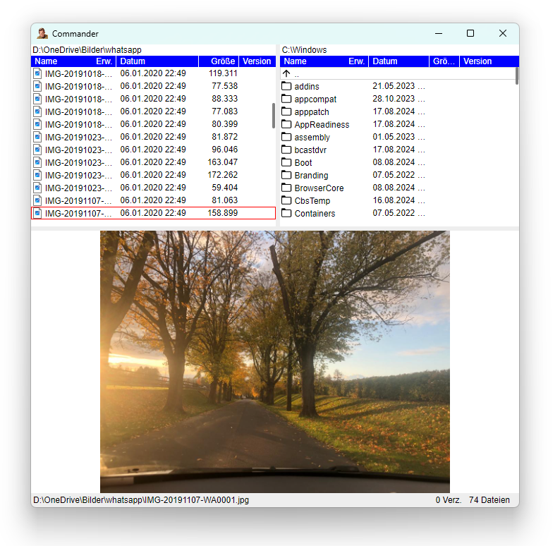
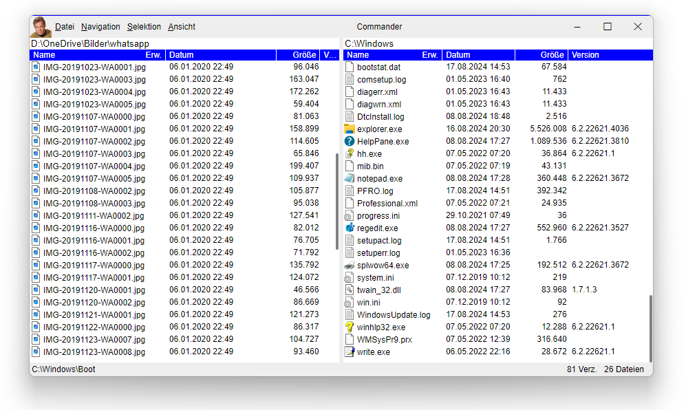
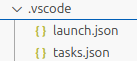

# WebWindowNetCore
A .NET 8 Webview Application for Windows and Linux similar to Electron. It uses a functional builder pattern to set up the application. It has an integrated Asp.NET (Kestrel) server which can be used to host the app and to communicate between the .NET application and the web app. The web site can be hosted as .NET resource, of course alternatively via HTTP(s):// or file://.

Sample WebWindowNetCore app:


WebWindowNetCore > version 10.0.0 is completely redesigned and programmed in F#, so that it is "F# friendly". Of course C# is supported as well. Unlike the older versions, there is no other Nuget packet required other than this. 

> WebViewNetCore.Linux and WebViewNetCore.Windows are now obsolete!

# Table of contents
1. [Introduction](#features)
2. [Setup](#setup)
    1. [Prerequisites for Windows](#prewindows)
    2. [Prerequisites for Linux](#prelinux)
3. [Hello World (a minimal web view app)](#helloworld)
    1. [Adaptions for debug and build integration in visual studio code](#adaptionHelloWorld)
4. [Features of WebViewBuilder](#features)
    1. [Creating WebViewBuilder and running app](#featuresCreating)
    2. [Url](#featuresUrl)
    3. [Custom resource scheme](#featuresCustomScheme)
    4. [Custom resource scheme via HTTP Server](#featuresCustomSchemeHttp)
    5. [DebugUrl](#featuresDebugUrl)
    6. [Title](#featuresTitle)
    7. [InitialBounds](#featuresInitialBounds)
    8. [AppId](#featuresAppId)
    9. [SaveBounds](#featuresSaveBounds)
    10. [ResourceIcon](#featuresResourceIcon)
    11. [CanClose](#featuresCanClose)
    12. [OnStarted](#featuresOnStarted)
    13. [DevTools](#featuresDevTools)
    14. [DefaultContextMenuDisabled](#featuresDefaultContextMenuDisabled)
    15. [RequestPort](#featuresRequestPort)
5. [Hosting react](#featuresHostingReact)

## Features <a name="features"></a>

WebWindowNetCore includes following features:
* Is built on .NET 8
* Functional approach with a builder pattern
* (almost) the same setup for Windows and Linux version
* Uses WebView2 on Windows and WebKitGtk-6.0 (with [Gtk4DotNet](https://github.com/uriegel/Gtk4DotNet) P/Invoke bindings) on Linux
* Can serve the web site via .NET resources (single file approach)
* Optional save and restore of window bounds
* Has an integrated event sink mechanismen, so you can retrieve javascript events from the .NET app
* Has an integrated .NET Kestrel Server (optional) to serve requests from .NET app to javascript
* You can expand the Gtk Window (on Linux) with a custom header bar
* You can alternatively disable the Windows titlebar and borders, and you can build a title bar in HTML with standard Windows logic for closing, maximizing, restoring resizing, snap to dock, ...

Functional approach with webview builder:

```cs
new WebView()
    .AppId("de.uriegel.test")
    .InitialBounds(1200, 800)
    .Title("Web Window Net Core 👍")
    .ResourceIcon("icon")
    .ResourceScheme()
    .SaveBounds()
    .DefaultContextMenuDisabled()
    .AddRequest<Input, Contact>("cmd1", GetContact)
    .AddRequest<Input2, Contact2>("cmd2", GetContact2)
#if DEBUG    
    .DevTools()
#endif
    .Url("res://webroot/index.html")
    .CanClose(() => true)
    .OnStarted(action => action.ExecuteJavascript ("console.log('app started now ')"))
    .Run();
```
Sample of a Windows App with custom titlebar:
 

## Setup <a name="setup"></a>

### Prerequisites for Windows <a name="prewindows"></a>

On Windows 10 or Windows 11 WebView2 is already installed, you don't have to do anything.

If you want to run the WebView app on a Windows Server, you have to install the necessary WebView2 runtime. Please consult the relevant web site from Microsoft.

### Prerequisites for Linux <a name="prelinux"></a>

On modern Linux like Ubuntu 24.04 WebWindowNetCore app will run out of the box (if you create a full contained single file exe), otherwise you have to install the necessary dotnet runtime.

On older/other Linux systems perhaps you have to install one of the following packages in order to make the app runnable, like

``` 
sudo apt install libwebkitgtk-6.0-dev
sudo apt install libgtk-4-dev
sudo apt install libadwaita-1-dev
```

For example on Linux Mint 22 you only have to install 

``` 
sudo apt install libwebkitgtk-6.0-dev
```
## Hello World (a minimal web view app) <a name="helloworld"></a>

In this tutoriual I am using Visula Studio Code, but of course you can also use Visual Studio, but only on Windows.

* Start Visual Studio Code and navigate ot a newly created project folder, in this case ```~/projects/HelloWorld```
* Open a terminal window in code and type ```dotnet new console```.
* Press ```F5``` to run the newly created project and to see that it runs
* Set up the project file so that it looks like this: 

```xml
<Project Sdk="Microsoft.NET.Sdk">
  <PropertyGroup>
    <IsWindows Condition="'$([System.Runtime.InteropServices.RuntimeInformation]::IsOSPlatform($([System.Runtime.InteropServices.OSPlatform]::Windows)))' == 'true'">true</IsWindows> 
		<IsOSX Condition="'$([System.Runtime.InteropServices.RuntimeInformation]::IsOSPlatform($([System.Runtime.InteropServices.OSPlatform]::OSX)))' == 'true'">true</IsOSX> 
		<IsLinux Condition="'$([System.Runtime.InteropServices.RuntimeInformation]::IsOSPlatform($([System.Runtime.InteropServices.OSPlatform]::Linux)))' == 'true'">true</IsLinux>  
    <ImplicitUsings>enable</ImplicitUsings>
    <Nullable>enable</Nullable>
  </PropertyGroup>

  <PropertyGroup Condition="'$(IsWindows)'=='true'">
    <OutputType>WinExe</OutputType>
    <IncludeNativeLibrariesForSelfExtract>true</IncludeNativeLibrariesForSelfExtract>
    <TargetFramework>net8.0-windows</TargetFramework>
    <RuntimeIdentifier>win-x64</RuntimeIdentifier>
    <SelfContained>false</SelfContained>
  </PropertyGroup> 

  <PropertyGroup Condition="'$(IsLinux)'=='true'">
    <OutputType>Exe</OutputType>
    <TargetFramework>net8.0</TargetFramework>
    <RuntimeIdentifier>linux-x64</RuntimeIdentifier>
    <SelfContained>true</SelfContained>
  </PropertyGroup> 

  <PropertyGroup Condition="'$(IsWindows)'=='true'">
    <DefineConstants>Windows</DefineConstants>
  </PropertyGroup>

  <PropertyGroup Condition="'$(IsLinux)'=='true'">
    <DefineConstants>Linux</DefineConstants>
  </PropertyGroup>

</Project>
```
In the first property group we declare ```IsWindows``` and ```IsLinux``` conditions based on the platform.

In the second and third property group we make platform dependant changes, like ```OutputType``` ```WinExe``` on Windows and ```Exe``` on Linux. We also set up the correct runtime ans target identifiers. 

In the two last property groups we define constants ```Windows``` and ```Linux``` based on the current platform which you can use to in code with preprocessor conditions:

```
#ifdef Linux
    ...
#endif
```
Now we can import the necessary nuget package WebWindowNetCore (version 10 or higher!) by typing the following in the terminal window:

```
dotnet add package WebWindowNetCore --version 10.0.0-beta-10
```

For a minimal program replace all from the file "Program.cs" with:


```cs
using WebWindowNetCore;

new WebView()
    .Url("https://google.de")
    .Run();
```

Now type ```dotnet run``` in the terminal and the web view app is starting and you see something like this:


Congratulations! Your first web view app is running!

### Adaptions for debug and build integration in visual studio code <a name="adaptionHelloWorld"></a>

When you press ```F5```, the old terminal program is running, not the newly build web view app. This is because you has changed the target and runtime identifier. In order to debug the app in visul studio code you should add two files in a folder ```.vscode```, if they are not already present:



The content of ```tasks.json``` shoud look like this:

```
{
    "version": "2.0.0",
    "tasks": [
        {
            "label": "build",
            "command": "dotnet",
            "type": "process",
            "args": [
                "build",
                "${workspaceFolder}/HelloWorld.csproj",
                "/property:GenerateFullPaths=true",
                "/consoleloggerparameters:NoSummary;ForceNoAlign"
            ],
            "problemMatcher": "$msCompile"
        }
    ]
}        
```

while ```launch.json``` should lkook like

```
{
    "version": "0.2.0",
    "configurations": [
        {
            "name": ".NET Core Launch (Linux)",
            "type": "coreclr",
            "request": "launch",
            "preLaunchTask": "build",
            "program": "${workspaceFolder}/bin/Debug/net8.0/linux-x64/HelloWorld.dll",
            "args": [],
            "cwd": "${workspaceFolder}",
            "console": "internalConsole",
            "stopAtEntry": false
        }, {
            "name": ".NET Core Launch (Windows)",
            "type": "coreclr",
            "request": "launch",
            "preLaunchTask": "build",
            "program": "${workspaceFolder}bin/Debug/net8.0-windows/win-x64/HelloWorld.dll",
            "args": [],
            "cwd": "${workspaceFolder}",
            "console": "internalConsole",
            "stopAtEntry": false
        }
    ]
}
```

Now you can choose your platform (Linux or Windows) in the debugger tab of the sidebar in Visual Studio Code and build and debug your app.

## Features of WebViewBuilder <a name="features"></a>

### Creating WebViewBuilder and running app <a name="featuresCreating"></a>

The absolute minial program is

```cs
using WebWindowNetCore;

new WebView()
    .Run();
```

```new WebView()``` creates a new WebViewBuilder. This builder has a lot of optional builder functions to add behaviors to the web app. At the end you have to call the function ```Run```. This function creates the web view app, runs the application and show the web view. 

Of course in this minimal setup only an empty window appears. You have to call one or more of the following builder functions. They have all in common that they are optoinal and are returning the web view builder, so that the builder functions can be chained and one big declaration is created.

When you close the window, the app is stopping.

### Url <a name="featuresUrl"></a>

In the minimal sample above a web view was created, but it was empty. So the most important builder function is ```Url``` to set an url like this:

```cs
using WebWindowNetCore;

new WebView()
    .Url("https://google.de")
    .Run();
```
Now the web app is doing something, it is displaying Google's home page! 

You can use ```http(s)://``` scheme, ```file://``` scheme, and custom resource scheme ```res://```. 

### Custom resource scheme <a name="featuresCustomScheme"></a>

The complete web site can be included as .NET resources. With the ```res://``` url specifier it is possible that the web view is automatically loaded from resources. All you have to do is include the website parts as .NET resources and add logical names with the help of the ```LogicalName``` node. The resources have to be included in the .csproj file like this:

```
<ItemGroup>
    <EmbeddedResource Include="../webroot/index.html">
      <LogicalName>webroot/index.html</LogicalName>
    </EmbeddedResource>
    <EmbeddedResource Include="../webroot/css/styles.css">
      <LogicalName>webroot/css/styles.css</LogicalName>
    </EmbeddedResource>
    <EmbeddedResource Include="../webroot/scripts/script.js">
      <LogicalName>webroot/scripts/script.js</LogicalName>
    </EmbeddedResource>
    <EmbeddedResource Include="../webroot/images/image.jpg">
      <LogicalName>webroot/images/image.jpg</LogicalName>
    </EmbeddedResource>
  </ItemGroup> 
```

The property ```Include``` specifies the local file path of the web file. ```LogicalName``` is the path name which is used to identifiy the resource from the custom resource scheme. The url is in this case: 

```
...
.Url("res://webroot/index.html")
...
```
the sub files are requested by the html file:

```
...
<head>
    ...
    <link rel="stylesheet" href="css/styles.css">
    ...
</head>
<body>
    ...
        
    ...
    <script src="scripts/script.js"></script>
    ...
```

All urls in the index.html file are relative to ```/webroot```, so that the resources are requested with the correct absolute path matching the logical name.

### Custom resource scheme via HTTP Server <a name="featuresCustomSchemeHttp"></a>

The ```res``` scheme has the following pitfall:
* It is not CORS enabled in Windows, because the origin is always ```null```. If you want to call HTTP requests form the web site, it is not possible in Windows.

Due to this you have the possibility to get the web site from resource via the included Kestrel HTTP-Server:

```
...
.ResourceFromHttp()
...
```
You don't have to set the ```.Url()``` property.

Important hint:

* The url is automatically set to ```http://localhost/webroot/index.html```. You have to set the ```LogicalName``` properties of the resources accordingly.

### DebugUrl <a name="featuresDebugUrl"></a>

Sometimes you have to use a different url for debugging the app, for example when you use a react app. If you want to debug this web app, you have to use vite's debug server ```http://localhost:5173```. But when you build the final web app, you want to include the built web app as .NET resource with ```res://```.

For debugging the web app you can use the builder function ```DebugUrl``` together with ```Url```. When you are debugging in visual studio code, the debug url is being used whereas in the relaese version the normal url is used:

```cs
    ...
    .Url("res://webroot/index.html")
    .DebugUrl("http://localhost:5173")
    ...
```
### Title <a name="featuresTitle"></a>

The created app has no title. Take the builder function ```Title``` to set one.

```cs
    ...
    .Title("My phenominal web app")
    ...
```
### InitialBounds <a name="featuresInitialBounds"></a>

With the help of the property ```InitialBounds``` you can initialize the size of the window with custom values.

```cs
...
.InitialBounds(1200, 800)
...
```
In combination with ```SaveBounds``` this is the initial width and heigth of the window at first start, otherwise the window is always starting with these values.

### AppId <a name="featuresAppId"></a>

The ```AppId``` is necessary for a webview app on Linux, it is the AppId for a ```GtkApplication```. It is a reverse domain name, like

```cs
...
.AppId("de.uriegel.webapp")
...
```
### SaveBounds <a name="featuresSaveBounds"></a>

When you call ```SaveBounds```, then windows location and width and height and normal/maximized state is saved on close. After restarting the app the webview is displayed at these settings again.

```cs
...
.AppId("de.uriegel.webapp")
.SaveBounds()
...
```
The ```AppId``` is used to create a path, where these settings are saved.

### ResourceIcon <a name="featuresResourceIcon"></a>

With ```ResourceIcon``` you can display a windows icon from C# resource. It is only working on Windows.

```cs
...
.ResourceIcon("icon")
...
```

The icon has to be included as C# resource with the ```LogicalName``` matching, in the project file:

```
<ItemGroup>
  <EmbeddedResource Include="../icon.ico">
    <LogicalName>icon</LogicalName>
  </EmbeddedResource>
</ItemGroup> 
```
### CanClose <a name="featuresCanClose"></a>

Here you can set a callback function which is called when the window is about to close. In the callback you can prevent the close request by returning false.

```cs
bool CanClose()
{
    ...
}

...
.CanClose(CanClose)
...
```

### OnStarted <a name="featuresOnStarted"></a>

```OnStarted``` is a callback which is called when the web view is loaded.

### DevTools <a name="featuresDevTools"></a>

Used to enable (not to show) the developer tools. Otherwise it is not possible to open these tools.
The developer tools can be shown by default context menu or by calling the javascript method ```WebView.showDevtools()```

```cs
...
#if DEBUG    
    .DevTools()
#endif
...
```
### DefaultContextMenuDisabled <a name="featuresDefaultContextMenuDisabled"></a>

If you set ```DefaultContextMenuDisabled```, the web view's default context menu is not being displayed when you right click the mouse..

```cs
...
.DefaultContextMenuDisabled()
...

```
====================================

### ResourceFromHttp


### BackgroundColor

### AddRequest

### Requests (F# Giraffe version)

### RequestsDelegates (C# version)

### CorsDomains

### CorsCache

### OnEventSink

### RequestPort <a name="featuresRequestPort"></a>

### WithoutNativeTitlebar

### TitleBar 

### OnFormCreating
### OnHamburger
### OnFilesDrop

## Typescript definitions

## Hosting react <a name="featuresHostingReact"></a>
in res:// : no requests in Windows
res://index.html

=> resource via HTTP:
react: set base url in vite.config.js